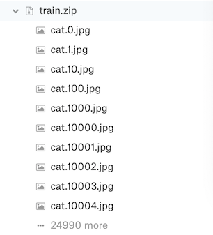

# Machine Learning Engineer Nanodegree
## Capstone Proposal
顾飞 优达学城  
2019年03月20日

## Proposal
-    AWS
-    Dogs vs. Cats 项目背景
-    项目描述
-    数据集
-    解决方案
-    模型选择
-    结果评估
-    项目实施

### AWS
由于此项目要求的计算量较大，也许你能够在本地 CPU 上训练。训练过程可能持续几个小时，取决于迭代次数、神经网络的大小和其他因素。

一种更快速的方法是在 GPU (图形处理器)上进行训练。虽然 CPU 可以比 GPU 计算更复杂的运算，但是吞吐量较小。因此在训练神经网络时，GPU 比 CPU 的速度要快很多。GPU 在同一时间会执行更多的计算，当我们处理大数据时这很重要。

你也可以自己购买 NVIDIA GPU，但是并非像将 GPU 插入机器那么简单。即使你知道如何安装 GPU，但是正确地安装 cuDNN 还是有一定的挑战。因此，我们不建议这么使用 GPU。

我们建议使用 Amazon EC2 实例，使用 Amazon p3.2xlarge 云服务器来完成该项目。

PS：如果你不想自己从头开始训练模型，重复造轮子。也可以使用预训练模型，提高训练准确度。

### Domain Background
[Dogs vs. Cats Redux: Kernels Edition](https://www.kaggle.com/c/dogs-vs-cats-redux-kernels-edition)

项目来源于 kaggle 在 2013 年组织的一场比赛：识别猫与狗。目前 Leaderboard 上展示了 1314 支队伍的成绩，排名第一的 score 是 0.03302，Top2% 的成绩是 0.04357。本项目的最低要求是 kaggle Public Leaderboard 前 10%，即 0.06149。

### Problem Statement
本文会通过 Keras 搭建一个深度卷积神经网络来识别一张图片是猫还是狗，融合三种模型，准确率直升99%。

### Datasets and Inputs
此数据集可以从 kaggle 上下载。[Dogs vs. Cats Redux: Kernels Edition](https://www.kaggle.com/c/dogs-vs-cats-redux-kernels-edition/data)

<figure class="half">
    
    
</figure>

训练集文件夹中一共 25000 张图片，猫和狗各占一半。每张图片有标签，文件名以 cat/dog.no.jpg 命名（如，cat.1.jpg）。测试集文件夹中一共 12500张图片，每张图片以数字编号命名（如，1.jpg），没有标签。我们需要预测测试集中的每一个图片是猫还是狗 (1 = dog, 0 = cat)。

### Solution Statement
_(approx. 1 paragraph)_

In this section, clearly describe a solution to the problem. The solution should be applicable to the project domain and appropriate for the dataset(s) or input(s) given. Additionally, describe the solution thoroughly such that it is clear that the solution is quantifiable (the solution can be expressed in mathematical or logical terms) , measurable (the solution can be measured by some metric and clearly observed), and replicable (the solution can be reproduced and occurs more than once).

### Benchmark Model
_(approximately 1-2 paragraphs)_

In this section, provide the details for a benchmark model or result that relates to the domain, problem statement, and intended solution. Ideally, the benchmark model or result contextualizes existing methods or known information in the domain and problem given, which could then be objectively compared to the solution. Describe how the benchmark model or result is measurable (can be measured by some metric and clearly observed) with thorough detail.

### Evaluation Metrics
_(approx. 1-2 paragraphs)_

In this section, propose at least one evaluation metric that can be used to quantify the performance of both the benchmark model and the solution model. The evaluation metric(s) you propose should be appropriate given the context of the data, the problem statement, and the intended solution. Describe how the evaluation metric(s) are derived and provide an example of their mathematical representations (if applicable). Complex evaluation metrics should be clearly defined and quantifiable (can be expressed in mathematical or logical terms).

### Project Design
_(approx. 1 page)_

In this final section, summarize a theoretical workflow for approaching a solution given the problem. Provide thorough discussion for what strategies you may consider employing, what analysis of the data might be required before being used, or which algorithms will be considered for your implementation. The workflow and discussion that you provide should align with the qualities of the previous sections. Additionally, you are encouraged to include small visualizations, pseudocode, or diagrams to aid in describing the project design, but it is not required. The discussion should clearly outline your intended workflow of the capstone project.

-----------

**Before submitting your proposal, ask yourself. . .**

- Does the proposal you have written follow a well-organized structure similar to that of the project template?
- Is each section (particularly **Solution Statement** and **Project Design**) written in a clear, concise and specific fashion? Are there any ambiguous terms or phrases that need clarification?
- Would the intended audience of your project be able to understand your proposal?
- Have you properly proofread your proposal to assure there are minimal grammatical and spelling mistakes?
- Are all the resources used for this project correctly cited and referenced?
